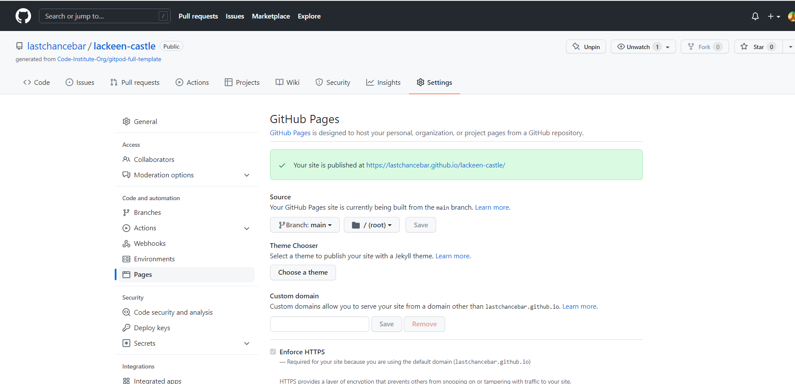
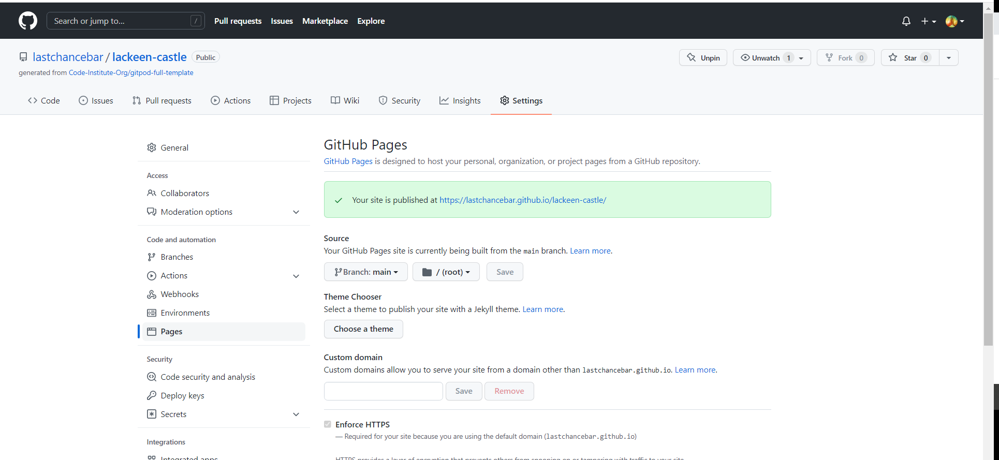
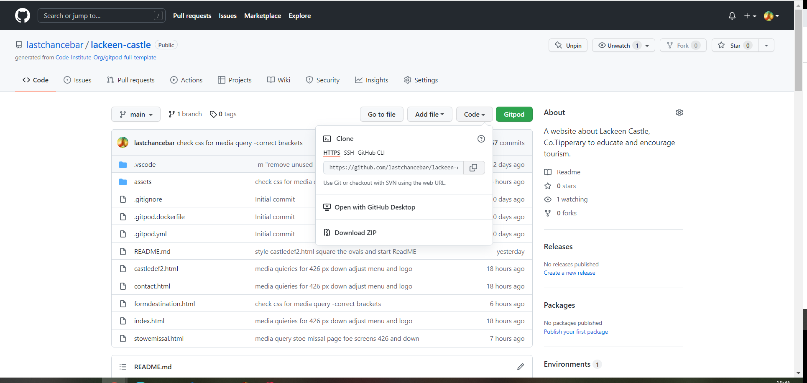

LACKEEN CASTLE

 Lackeen Castle is a 1,000 year old ruined castle in North Tipperary, Ireland. This site tells the story of Lackeen Castle and the Stowe Missal, a manuscript found there, and is targeted at tourists and historians worldwide. This website draws together interesting facts and images to inspire people to visit and to find out more.
 
 Here is a link to the [Lackeen Castle](https://lastchancebar.github.io/lackeen-castle/)>website.

------

# contents

* [**User Experience UX**](<#user-experience-ux>)
    *  [User Stories](<#user-stories>)
    * [Wireframes](<#wireframes>)
    * [Site Structure](<#site-structure>)
    * [Design Choices](<#design-choices>)
    *  [Typography](<#typography>)
    *  [Colour Scheme](<#colour-scheme>)
* [**Features**](<#features>)
    
     * [Navigation menu](<#navigation-menu>)
    * [**Home**](<#navigation-menu>)
         * [location](<#location>)
            *map
            *contact details
         
         
         * [Footer](<#footer>)
    * [**Defences**](<#defences>)
        * [Fact-boxes] (<#fact-boxes>)
    * [**IStowe-Missal**](<#Stowe-Missal>)
        
    * [**Booking-form**](<#booking-form>)
       
       
    * [**Form destination**](<#form-cdestination>)
    * [**Future Features**](<#future-features>)
* [**Technologies Used**](<#technologies-used>)
* [**Testing**](<#testing>)
* [**Deployment**](<#deployment>)
* [**Credits**](<#credits>)
    * [**Content**](<#content>)
    * [**Media**](<#media>)
*  [**Acknowledgements**](<#acknowledgements>)

# User Experience (UX)

User Requirements

As a user I want to be able to navigate through the whole site smoothly.
As a user I want to understand the purpose of the site upon loading it.
As a user I want to easily be able to contact Lackeen Castle for more information.
As a user I want to know more about Lackeen Castle and the Stowe Missal.
As a user I want to know more about Lackeen Castle and the Stowe Missal by using the links provided.
As a user I want to know how to get to Lackeen Castle.
As a user I want to connect with Lackeen Castle on social media.
As a user I want to be able to comment, book a tour and find out if my special requirements if any can be met.

# Wireframes

As I was not familiar enough with Balsamiq, I did not persist with them in planning my project, but this project journey has taught me the value of planning with wireframes and I will do so in future and save a lot of time.

# Site Structure

Lackeen Castle website has 5 pages. The <a url=(https://github.com/lastchancebar/lackeen-castle/blob/main/index.html)>home page</a> is the default landing page. The <a url=(https://github.com/lastchancebar/lackeen-castle/blob/main/castledef2.html)>castle defences,<a url=(https://github.com/lastchancebar/lackeen-castle/blob/main/stowemissal.html)>Stowe Missal</a> and <a url=(https://github.com/lastchancebar/lackeen-castle/blob/main/contact.html)>Contact/guided tours pages are accessable from the navigation menu. There is also a <a url=(https://github.com/lastchancebar/lackeen-castle/blob/main/formdestination.html)>form destination/thank you</a> page which loads when the reader submits the contact/booking form.

[ Back to Top] (<#contents>)

## Design choices

* ### Typography

I chose fonts which I thought conveyed history -'Eczar' for headings and 'PT+ Serif' for content, both on Google fonts which is shown at top of CSS file. Both fonts fall back to serif so they complement one another. As serif fonts it would not be difficult to substitute them in the event of one or both not being available .
 

 * ### Colour Scheme

 I chose #00008b Navy blue for background to inspire history and learning.
 I chose Bisque - a warm cream-white, for text, a good contrast to the navy background. Blue snd white arethe local GAA club colours , which wouldn't be lost on local viewers of the website.
 I also used a dark red with 0.7 opacity for information bubbles which were on top of images.
 Coral was used to highlight clickable links in content. It was a bit too bright but more visible thatn several yellows I tried.

 I didn't use colorpicker but will do in future.

 One of the weaknesses lightouse flagged was that there was a lack of contrast in my my headings which were overlaid on pictures. I was able to back them with a .7 opacity ark red box but as screen sizes went down, this box had to go.

 # Features

 Lackeen Castle website is set up to be informative,  welcoming and easy to use. It contains features familiar to users - a navigation bar and contact/booking form.

    
 ## Existing features
 * ### Navigation Menu

Sited at the top of all the pages in the site, it is fully responsive and contains links to all bar one of the pages of the site to enable ease of navigation in one convenient location.

[back to  top] (#contents)}
## Home page
 
This page introduces the castle, its age, owners, defence features aand a manuscript that was found in the walls. There are links in the content to the defence page and Stowe missal page which invite the user to explore the website further.

to visit the castle a map and directions are set out.

# Defences

This page is educational, inviting the reader to look more closely at the stone walls of the castle and to reflect of life in medieval times in Ireland.  Defence features described in this page in fact-boxes.
* ### Fact-boxes

These boxes contain information on narrow windows, machicolations, and the  murder hole secreted above the door of the castle. This page is to whet the readers' interest and also as a learning tool, might encourage school visits to the area. I think this would appeal to gamers/ Game of Thrones fan-types and pre-teen  boys!

# Stowe Missal

This relatively unknown artefact manuscript is a little similar to the Books of Kells,  a relic of an important monastic settlement in Lorrha, Co. Tipperary. The purpose of this page is to tell the world,  display the beautiful penmanship  and the craftwork of the Reliquary and encourage people to visit the area where it was found. 

# Contact /Guided tour booking form

The contact/booking form iand useful to encourage including visits on a preplanned itinerary by tourist. This will improve the visitors experience and boost the economy of the local area.

# Form Destination page

This page loads when details are submitted in the contact form. It thanks the reader and promises to contact them soon.

# Footer

Contains social media links. To enhance the UX the links open in other tabs.
The social media presence will help the user 
* to keep up to date with events happening around Lackeen Castle and the Stowe Missal. It will also encourage them 
* to connect with Lackeen Castle 
* provide testamonials - spread the word.
All links work.

# Future features 

* An online shopping page  for souvenirs, artwork and books and periodicals.
* Online booking with payment on booking for guided tours.
* Live streaming of talks given by local historical society and historical plays by local drama group.</li>
* O Kennedy family tree page/ clan reunion.

# Technologies used

* [HTML5] - provides the content and structure for the website.
* [CSS] - provides the styling.
* [Balsamiq] - used to create the wireframes not used properly as first attempt so not included here.
* [Gitpod] - used to deploy the website.
* [Github] - used to host and edit the website.
* [Google]  devtools were very helpful for responsiveness, finding glitches and providing  visuals on margins and padding. 

# Testing
Please refer to <a href=(https://github.com/lastchancebar/lackeen-castle/blob/main/testing.md)>here</a>for more information on testing of Lackeen Castle.

# Deployment
### **To deploy the project**
The site was deployed to GitHub pages. The steps to deploy a site are as follows:

1. In the GitHub repository, navigate to the **Settings** tab.

2. Once in Settings, navigate to the **Pages** tab on the left hand side.

3. Under Source, select the branch to **master**, then click **save**.

Once the master branch has been selected, the page will be automatically refreshed with a detailed ribbon display to indicate the successful deployment.

  The live link to the Github repository can be found here -  https://github.com/lastchancebar/lackeen-castle

### **To fork the repository on GitHub**

A copy of the GitHub Repository can be made by forking the GitHub account. This copy can be viewed and changes can be made to the copy without affecting the original repository. Take the following steps to fork the repository;

1. Log in to **GitHub** and locate the [repository](https://github.com/lastchancebar/lackeen-castle).
2. On the right hand side of the page inline with the repository name is a button called **'Fork'**. Click on the button to create a copy of the original repository in your GitHub Account.

### **To create a local clone of this project**

The method from cloning a project from GitHub is below:

1. Under the repository’s name, click on the **code** tab. 
2. In the **Clone with HTTPS** section, click on the clipboard icon to copy the given URL.

3. In your IDE of choice, open **Git Bash**.

4. Change the current working directory to the location where you want the cloned directory to be made.

5. Type **git clone**, and then paste the URL copied from GitHub.

6. Press **enter** and the local clone will be created.

# Credits

### Contents
* The fonts came from Google.
* The map is embedded from Google Maps.
* The icons came from Font Awesome.
* The layout of the form destination page, email icon, and read me format was inspired by a Project  Wawa woods by Ewan Colquhoun which I forked with thanks(https://lastchancebar-wawaswoods-3jkv8uef12f.ws-eu30.gitpod.io/).
* The layout of the contact form, cover text on picture was inspired by the Love Running Project. 
* W3C was super for quick fix for little tech queries - display-block being one.
* I looked at Bunratty Castle and Book of Kells websites for ideas as to how the professionals present history on the web - a humbling experience!
* did a local history school project on the Stowe Missal many years ago, so I would like to thank my younger self for giving me inspiration. From scrap book to screen..... 

### Media

* Lackeen Castle images came from  Jim Dempsey, author of  [Megalithic Ireland](http://www.megalithicireland.com/).I sought his permission by email to use these pictures and I acknowledge him.

* The Stowe Missal pictures came from the [Royal Academy of Ireland](https://www.ria.ie/)" website. Copies are available to students at a small fee. The blue Stowe Missal picture came from [Wikipedia](https://www.wikipedia.org) to whose funds I have contributed.

# Acknowledgements

The site was completed as a Portfolio 1 Project piece for the Full Stack Software Developer (e-Commerce) Diploma at the Code Institute. As such I would like to thank my mentor Precious Ijege, the Slack community, and all at the Code Institute for their help and support especially Kasia, my course administrator. 

Finally, I would like to acknowledge the class of strong and supportive women I am lucky to be part of and Mayo Sligo Leitrim ETB for giving us the opportunity to acquire the valuable skills with which I know we will go forth and conquer the world (of computing!!)

Darina Kelly 2022.