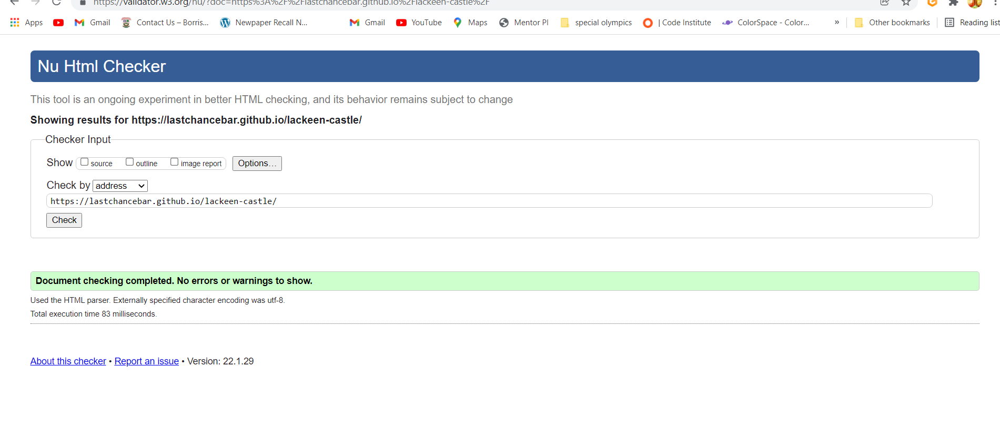
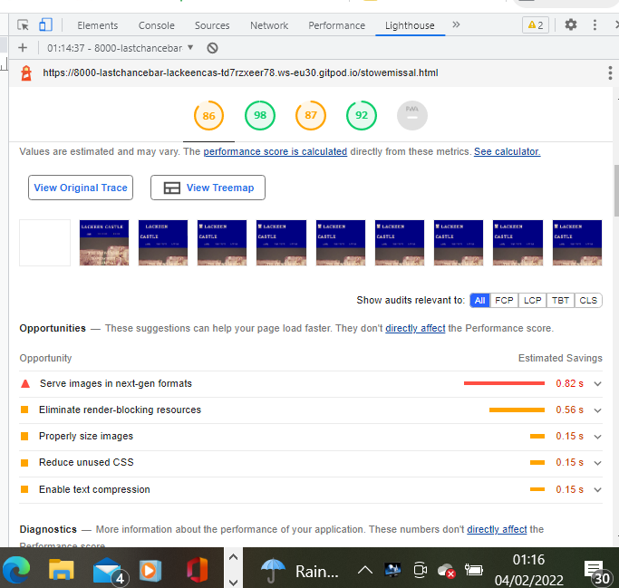

<h1> Testing</h1>
<h2>Code Validation</h2>

 The Lackeen Castle website has to be thoroughly tested.

 I conducted the following tests-
* HTML validaation   throught the W3c HTML checker. It turned up two minor errors which are fixed .

* CSS validation through w3c jigsaw validator. The same story applied.  A couple of small errors , one testing my knowledge of form elements and one of padding. I am particularly proud of this as my first attempt at validating my CSS turned upmore than 2 errors.! I have copied code for the CSS validation tick into my index.html page.

* Lighhouse  - the website scored 91 overall  with a LOT of pointers for making a better website. There is a lot of useful information in the report which I plan to study and learn from it. It is a great devtool.

* Using Google Devtools. I found Google devtools so helpful 
    * to test for reponsiveness without the eye of experience
    * to find the glitches when code wouldnt run.
    *figuring out margins and padding and why elements behaved or misbehaved! the way they did.

    <ing src="assets/readme-img/googledevtools.png">
    
